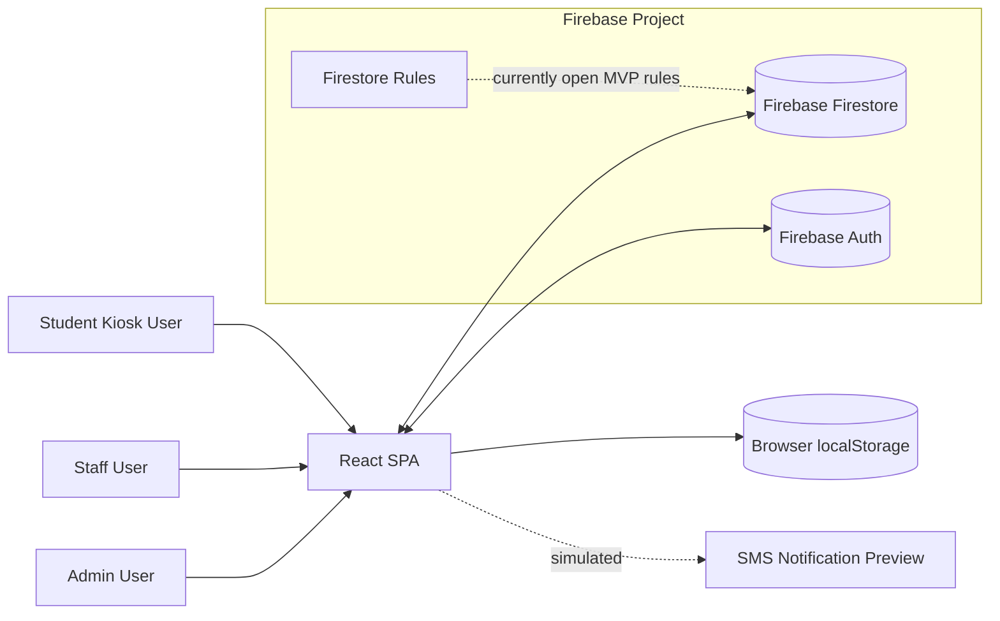

# Overview

## Purpose

This MVP manages student attendance for a school check-in/check-out process. It is designed around a front-desk or kiosk workflow where students can check themselves in/out by ID, staff can assist check-in/out, and admins can manage attendance data, students, and staff accounts.

The visible brand in the UI is `ABC Community School` / `ABC School`.

## Repository Snapshot

| Area | Details |
| --- | --- |
| App type | Single page application |
| Runtime | Browser |
| Build tool | Vite |
| UI framework | React 19 with TypeScript |
| Styling | Tailwind CSS v4 via `@tailwindcss/vite` |
| Data store | Firebase Firestore |
| Local fallback | `localStorage` |
| Auth model | Firebase Auth for staff/admin sign-in with Firestore/local fallback; student kiosk login by student ID |
| Backend/API | No dedicated application backend in current code |
| Main entry | `src/main.tsx`, `src/App.tsx` |
| Shared data service | `src/lib/db.ts` |
| Firebase setup | `src/lib/firebase.ts`, `firebase-applet-config.json` |

## Primary Roles

| Role | Entry path | Capabilities |
| --- | --- | --- |
| `student` | Login screen in Student mode using student ID | Self-service check-in/check-out, pickup selection, automatic return to kiosk |
| `staff` | Login screen in Staff/Admin mode using username/password | Student lookup, assisted check-in/check-out, active checked-in roster |
| `admin` | Login screen in Staff/Admin mode using username/password | Attendance audit logs, manual attendance records, corrections, student management, staff/admin management |

## Current Feature Scope

### Student Features

- Search/login by student ID.
- View student profile basics after ID match.
- Check in for the current date.
- Check out for the current date after staff/admin approval.
- Select an authorized pickup person before check-out where available.
- Require a staff/admin password or security PIN before direct student check-out is released.
- See a simulated SMS notification message after check-out.
- Auto-return to kiosk after completion.

### Staff Features

- Login with Firebase Auth email/password, with Firestore/local fallback credentials for MVP continuity.
- Lookup students by ID or name with live suggestions.
- View parent/guardian contact information.
- Check student in with staff audit fields.
- Check student out with pickup person capture.
- See currently checked-in students.

### Admin Features

- View, search, and filter attendance logs.
- Add manual attendance record.
- Correct existing attendance record.
- Delete attendance record.
- Add/edit/delete students.
- Add/delete staff and admin accounts.

## What Is Simulated or MVP-Only

| Concern | Current behavior | Production expectation |
| --- | --- | --- |
| Authentication | Staff/admin sign-in uses Firebase Auth first, with Firestore/local credential fallback; student kiosk login uses student ID only | Remove plaintext fallback credentials and rely on Firebase Auth, server-side auth, or another identity provider |
| Authorization | Role routing is controlled by client-side `user.role` | Firestore rules and backend enforcement |
| Firestore rules | `allow read, write: if true` for all app collections | Least-privilege rules |
| Password storage | Plaintext password field in `users` documents | Do not store plaintext passwords; use managed auth |
| SMS | UI marks SMS as sent and displays a preview | Real SMS provider such as Twilio, Firebase Extensions, or a server-side integration |
| Audit integrity | Admins can edit/delete records | Immutable audit trail or correction ledger |
| Offline support | localStorage cache/fallback | Defined offline-first strategy, conflict handling, and data retention policy |

## High-Level Context Diagram

## Important Files

| File | Why it matters |
| --- | --- |
| `src/App.tsx` | Owns active session state and role-based screen routing |
| `src/components/Login.tsx` | Student ID login plus staff/admin Firebase Auth email/password sign-in UI; Google sign-in and password reset are not completed |
| `src/components/StudentDashboard.tsx` | Student self-service check-in/out; direct check-out opens staff approval |
| `src/components/StaffApprovalModal.tsx` | Staff/admin password or security PIN verification before student direct check-out |
| `src/components/CheckInOut.tsx` | Staff-assisted check-in/out terminal |
| `src/components/CheckedInList.tsx` | Live checked-in roster for staff |
| `src/components/AdminAttendance.tsx` | Admin attendance audit table, create, correct, delete |
| `src/components/AdminStudents.tsx` | Admin student CRUD |
| `src/components/AdminStaff.tsx` | Admin staff/admin account creation and deletion |
| `src/lib/db.ts` | Data access layer, seed data, Firestore writes, realtime listeners, localStorage cache |
| `src/lib/firebase.ts` | Firebase app, Auth, and Firestore initialization |
| `src/lib/auth.ts` | Firebase Auth email/password sign-in, auth state, and profile mapping; Google sign-in/password reset helpers are present but not completed for the delivered flow |
| `src/types.ts` | Shared TypeScript data model |
| `src/lib/seedData.ts` | Generated 150-student demo dataset |
| `firestore.rules` | Current Firestore security rules |
| `firebase-blueprint.json` | Declared collection schema blueprint |
| `firebase-applet-config.json` | Firebase project/app configuration |

