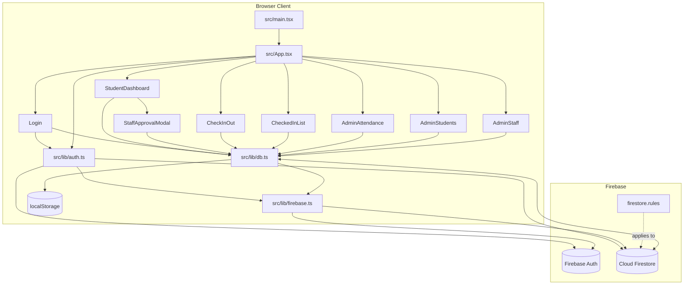
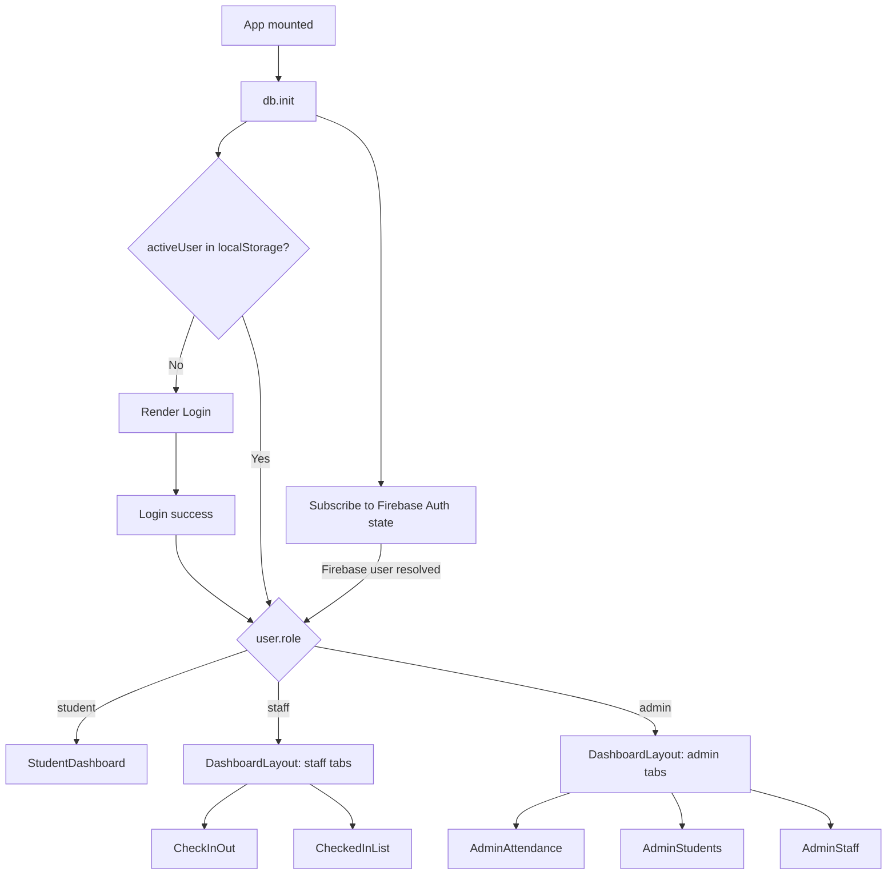
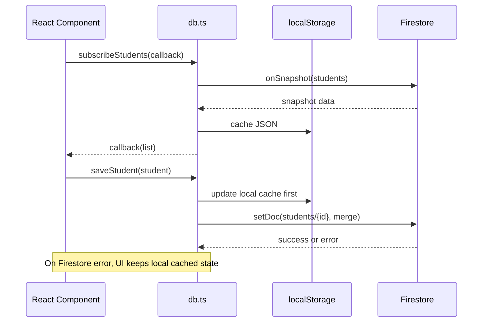
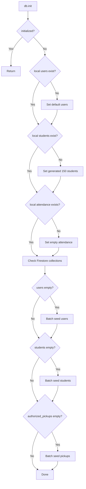

# Architecture

## System Architecture

The current app is a browser-only SPA. It does not call an application backend. Staff/admin authentication uses Firebase Auth through the Firebase Web SDK, while app profiles and attendance data live in Firestore. Persistent reads/writes go directly from the browser to Firestore, and the data layer mirrors Firestore data into local component state and `localStorage`.

## Frontend Composition

`App.tsx` is the top-level coordinator:

- Initializes the data layer through `db.init()`.
- Restores a cached session from `localStorage.activeUser`.
- Subscribes to Firebase Auth state through `subscribeToAuthState()`.
- Routes users to screens by `user.role`.
- Stores the active dashboard tab in component state.

## Component Responsibilities

| Component | Responsibility | Reads | Writes |
| --- | --- | --- | --- |
| `Login` | Student ID login and staff/admin Firebase Auth email/password sign-in; Google sign-in and password reset are not completed | `students`, Firebase Auth, `users` fallback | `activeUser` through parent callback; may create/sync `users` profile |
| `StudentDashboard` | Self-service check-in/out; opens staff approval for direct check-out | `students`, `attendance` | `attendance` after approval |
| `StaffApprovalModal` | Requires staff/admin password or security PIN before releasing student from direct checkout | `users` | None directly; returns authorizing staff to `StudentDashboard` |
| `CheckInOut` | Staff-assisted check-in/out | `students`, `attendance` | `attendance` |
| `CheckedInList` | Current on-site roster | `students`, `attendance` | None |
| `AdminAttendance` | Attendance audit, create, correct, delete | `attendance`, `students`, `users` | `attendance` |
| `AdminStudents` | Student CRUD | `students` | `students` |
| `AdminStaff` | Staff/admin account management | `users` | `users` |
| `DashboardLayout` | Sidebar, tabs, logout | `activeTab`, `user` props | `activeTab`, logout callback |

## Data Access Layer

All app data access is centralized in `src/lib/db.ts`.

### Collections

- `users`
- `students`
- `attendance`
- `authorized_pickups`

### Cache Keys

| Key | Purpose |
| --- | --- |
| `checkin_users` | Local copy of user list |
| `checkin_students` | Local copy of student list |
| `checkin_attendance` | Local copy of attendance records |
| `activeUser` | Cached active app user/session |

### Read/Write Pattern

## Initialization and Seeding

`db.init()` runs once per browser session. It:

1. Seeds `localStorage` with default users, generated students, and an empty attendance array if the local keys do not exist.
2. Checks Firestore `users` and seeds default users if empty.
3. Checks Firestore `students` and seeds 150 generated demo students if empty.
4. Checks Firestore `authorized_pickups` and seeds pickup records from generated students if empty.

## Dependency Overview

| Package | Used for |
| --- | --- |
| `react`, `react-dom` | App UI |
| `vite` | Dev server and production build |
| `typescript` | Type checking |
| `firebase` | Firebase Auth, Firestore connection, and realtime listeners |
| `date-fns` | Date formatting and `yyyy-MM-dd` current-day keys |
| `lucide-react` | UI icons |
| `react-hot-toast` | Toast notifications |
| `tailwindcss`, `@tailwindcss/vite` | Styling |
| `clsx`, `tailwind-merge` | Utility class merging through `src/lib/utils.ts` |
| `@google/genai`, `dotenv`, `express`, `motion`, `react-router-dom` | Present in dependencies but not materially used by current source code |

## State Management

There is no global state library. State is local to React components and synchronized by Firestore listeners.

| State | Owner |
| --- | --- |
| Active session user | `App.tsx`, persisted to `localStorage.activeUser` |
| Active admin/staff tab | `App.tsx` |
| Student/user/attendance lists | Component state populated by `db.subscribe*` |
| Data cache | Module-level arrays in `db.ts` plus `localStorage` |

## Routing

No URL routing is currently used. Although `react-router-dom` is installed, screens are switched through state in `App.tsx`.

