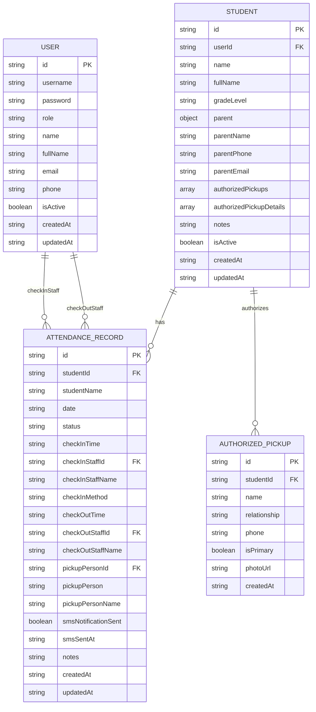
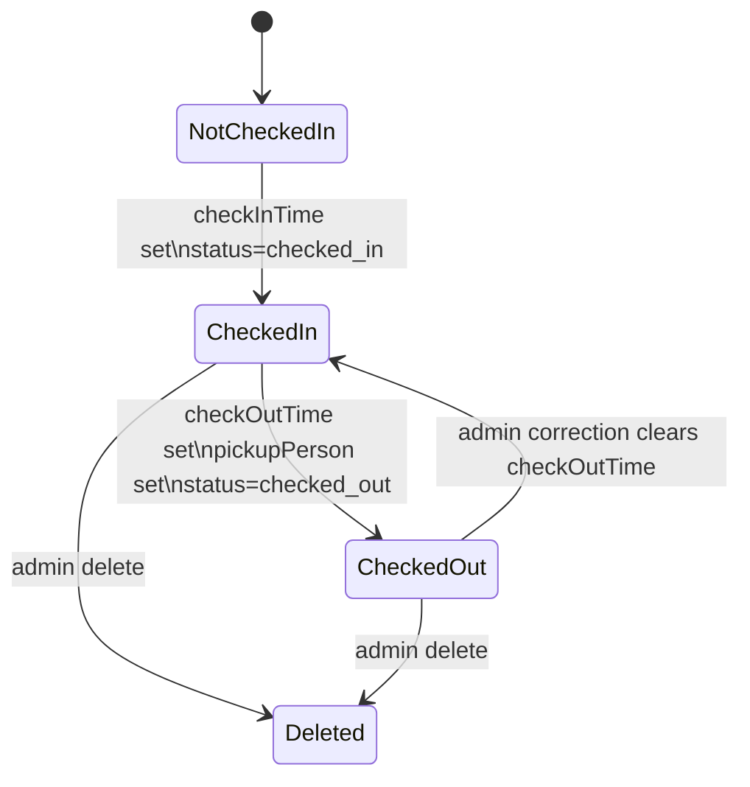

# Data Model and Schema

## Source of Truth

The TypeScript interfaces in `src/types.ts` are the app-level source of truth. `firebase-blueprint.json` mirrors the intended Firestore collections. `src/lib/db.ts` controls the exact serialization used when documents are written to Firestore.

## Entity Relationship Diagram



## Collection: `users`

Stores admin and staff accounts for MVP login. The `Role` union is `staff | admin | student`, but normal student login is built from `students` records and not persisted as `users` documents by default.

| Field | Type | Required in app | Notes |
| --- | --- | --- | --- |
| `id` | string | Yes | Firestore document ID also uses this value |
| `username` | string | Yes | Login identifier for staff/admin |
| `password` | string | MVP only | Plaintext in current MVP; must be removed for production |
| `role` | `admin` or `staff` or `student` | Yes | Controls client-side screen access |
| `name` | string | Yes | Display name |
| `fullName` | string | Optional | Usually same as `name` |
| `email` | string | Optional | Admin/staff contact |
| `phone` | string | Optional | Admin/staff contact |
| `isActive` | boolean | Optional | Written by data layer; not enforced in login |
| `createdAt` | ISO string | Optional | Created timestamp |
| `updatedAt` | ISO string | Optional | Last update timestamp |

### Default Users

Defined in `src/lib/db.ts`:

| Username | Password | Role | Name |
| --- | --- | --- | --- |
| `admin1` | `password` | `admin` | Alice Admin |
| `admin2` | `password` | `admin` | Bob Admin |
| `staff1` | `password` | `staff` | Charlie Staff |
| `staff2` | `password` | `staff` | Diana Staff |

## Collection: `students`

Stores student profile, guardian, and pickup data.

| Field | Type | Required in app | Notes |
| --- | --- | --- | --- |
| `id` | string | Yes | Student ID used for kiosk login and lookup; document ID also uses this value |
| `userId` | string or null | Optional | Reserved for future auth linkage |
| `name` | string | Yes | Primary display name |
| `fullName` | string | Optional | Usually same as `name` |
| `gradeLevel` | string | Optional | Displayed in dashboards |
| `parent` | object | Yes in UI forms | `{ name, phone, email? }` |
| `parentName` | string | Compatibility field | Duplicates `parent.name` |
| `parentPhone` | string | Compatibility field | Duplicates `parent.phone` |
| `parentEmail` | string | Compatibility field | Duplicates `parent.email` |
| `authorizedPickups` | string[] | Optional | Used by pickup selectors |
| `authorizedPickupDetails` | object[] | Optional | Richer pickup objects |
| `notes` | string | Optional | Stored/display-ready but not heavily surfaced |
| `isActive` | boolean | Optional | Written by data layer; not enforced in lookup |
| `createdAt` | ISO string | Optional | Created timestamp |
| `updatedAt` | ISO string | Optional | Last update timestamp |

### Student Shape

```json
{
  "id": "1001",
  "name": "Liam Smith",
  "fullName": "Liam Smith",
  "gradeLevel": "Kindergarten",
  "parent": {
    "name": "Camila Smith",
    "phone": "555-1000",
    "email": "camila.smith@example.com"
  },
  "parentName": "Camila Smith",
  "parentPhone": "555-1000",
  "parentEmail": "camila.smith@example.com",
  "authorizedPickups": [
    "Camila Smith",
    "Alexander Smith",
    "Hudson Rodriguez (Mother)"
  ],
  "authorizedPickupDetails": [
    {
      "name": "Camila Smith",
      "relationship": "Primary Guardian",
      "phone": "555-1000",
      "isPrimary": true
    }
  ],
  "notes": "Allergic to peanuts",
  "isActive": true,
  "createdAt": "2026-08-21T00:00:00.000Z",
  "updatedAt": "2026-08-21T00:00:00.000Z"
}
```

## Collection: `attendance`

Stores daily check-in/check-out records.

| Field | Type | Required in app | Notes |
| --- | --- | --- | --- |
| `id` | string | Yes | Random UUID; document ID also uses this value |
| `studentId` | string | Yes | References `students.id` |
| `studentName` | string | Optional | Denormalized display value |
| `date` | `YYYY-MM-DD` string | Yes | Current-day lookup key |
| `status` | `checked_in`, `checked_out`, `absent`, `excused` | Optional | App currently writes checked-in/out |
| `checkInTime` | ISO string or null | Yes | Check-in timestamp |
| `checkInStaffId` | string or null | Optional | References `users.id`; absent for self-service |
| `checkInStaffName` | string or null | Optional | Denormalized staff display name |
| `checkInMethod` | `kiosk`, `staff_manual`, `student_self` | Optional | Current app writes `staff_manual` or `student_self` |
| `checkOutTime` | ISO string or null | Yes | Null means active/on-site |
| `checkOutStaffId` | string or null | Optional | References `users.id` |
| `checkOutStaffName` | string or null | Optional | Denormalized staff display name |
| `pickupPersonId` | string or null | Optional | Reserved for richer pickup records |
| `pickupPerson` | string or null | Optional | Pickup display name |
| `pickupPersonName` | string or null | Optional | Duplicate compatibility field |
| `smsNotificationSent` | boolean | Optional | Current app marks simulated send state |
| `smsSentAt` | ISO string or null | Optional | Simulated SMS timestamp |
| `notes` | string | Optional | Admin correction note field exists in data model |
| `createdAt` | ISO string | Optional | Created timestamp |
| `updatedAt` | ISO string | Optional | Last update timestamp |

### Attendance Shape

```json
{
  "id": "4b22a5a7-7e1f-4f81-9de3-aef0a1e7cc61",
  "studentId": "1001",
  "studentName": "Liam Smith",
  "date": "2026-08-21",
  "status": "checked_out",
  "checkInTime": "2026-08-21T03:30:00.000Z",
  "checkInStaffId": "u3",
  "checkInStaffName": "Charlie Staff",
  "checkInMethod": "staff_manual",
  "checkOutTime": "2026-08-21T10:15:00.000Z",
  "checkOutStaffId": "u3",
  "checkOutStaffName": "Charlie Staff",
  "pickupPerson": "Camila Smith",
  "pickupPersonName": "Camila Smith",
  "smsNotificationSent": true,
  "smsSentAt": "2026-08-21T10:15:00.000Z",
  "notes": "",
  "createdAt": "2026-08-21T03:30:00.000Z",
  "updatedAt": "2026-08-21T10:15:00.000Z"
}
```

## Collection: `authorized_pickups`

The app stores pickup names directly on `students.authorizedPickups` for day-to-day UI selection. `db.init()` also seeds a separate `authorized_pickups` collection as a relational representation.

Current UI does not query `authorized_pickups` directly.

| Field | Type | Required in seed | Notes |
| --- | --- | --- | --- |
| `id` | string | Yes | Random UUID |
| `studentId` | string | Yes | References `students.id` |
| `name` | string | Yes | Pickup person name |
| `relationship` | string | Optional | Relationship to student |
| `phone` | string | Optional | Pickup phone |
| `isPrimary` | boolean | Optional | Primary guardian flag |
| `photoUrl` | string | Optional | Declared type field; not currently written by seed |
| `createdAt` | ISO string | Yes | Created timestamp |

## Attendance State Model



## Date and Time Conventions

- `date` is stored as local current day formatted with `date-fns` as `yyyy-MM-dd`.
- `checkInTime`, `checkOutTime`, `smsSentAt`, `createdAt`, and `updatedAt` are stored as ISO strings from `new Date().toISOString()`.
- UI renders times with `date-fns` format strings such as `h:mm a`.
- Admin date correction creates ISO timestamps from local date/time input values.

## Data Consistency Notes

- The schema intentionally denormalizes names (`studentName`, staff names, parent flat fields) to keep lists readable even if related records change.
- `parent` and `parentName`/`parentPhone`/`parentEmail` duplicate the same data for backward compatibility across generated and manually entered records.
- `authorized_pickups` is currently a seeded supporting collection, not the primary UI source.
- There is no uniqueness constraint in Firestore rules. Duplicate student IDs are prevented in the admin UI, but not at the database rule level.
- There is no database transaction that prevents duplicate attendance records for the same `studentId` and `date`; the UI prevents most duplicate paths by checking today records first.

