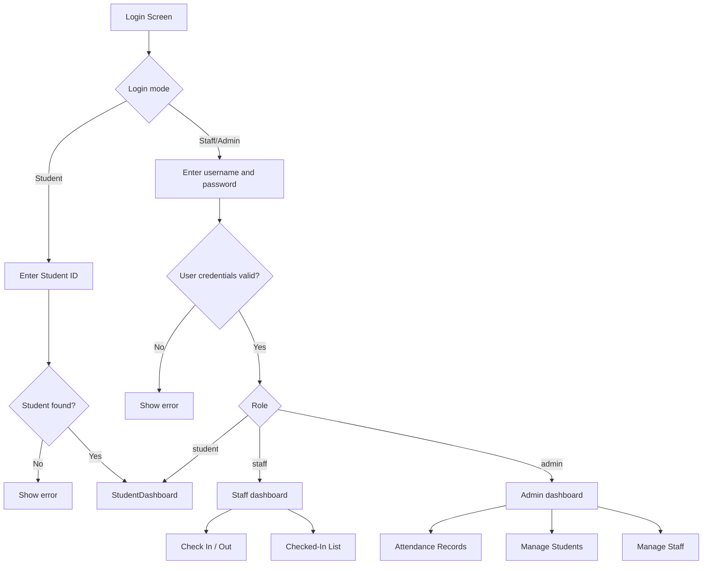
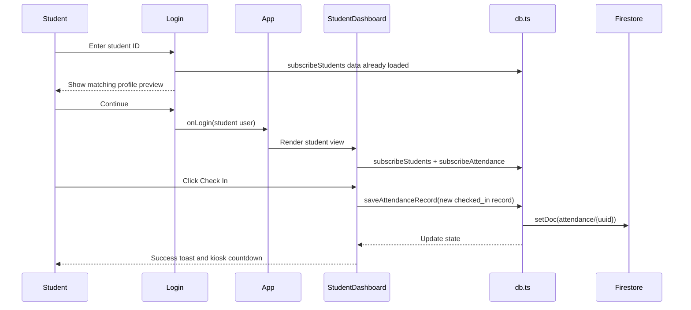
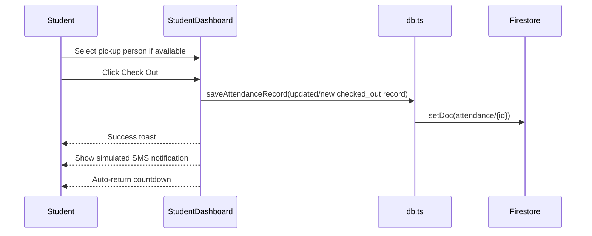
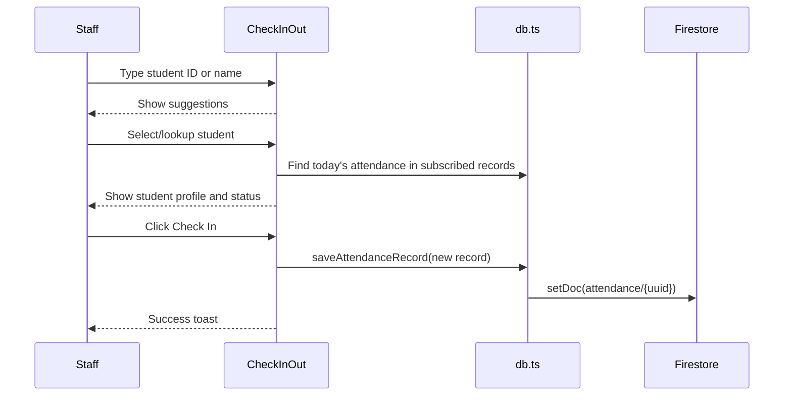
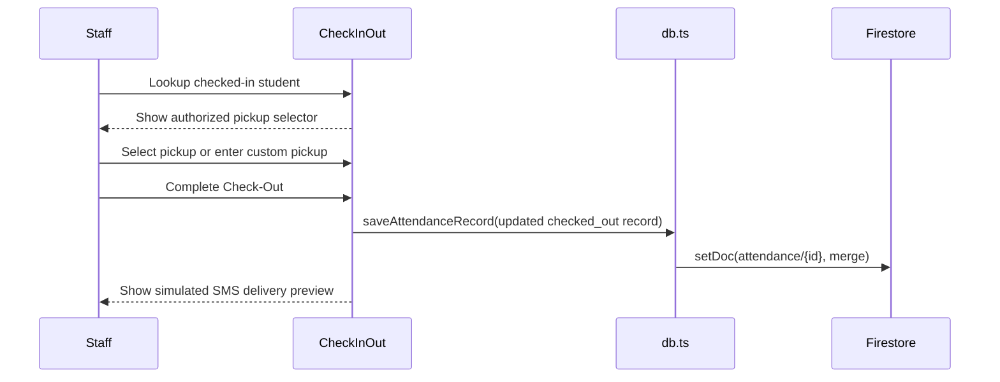
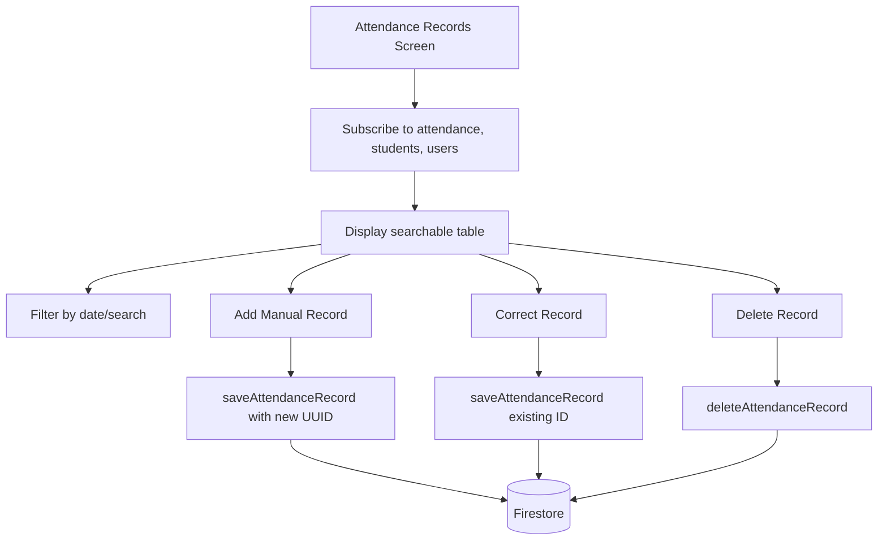
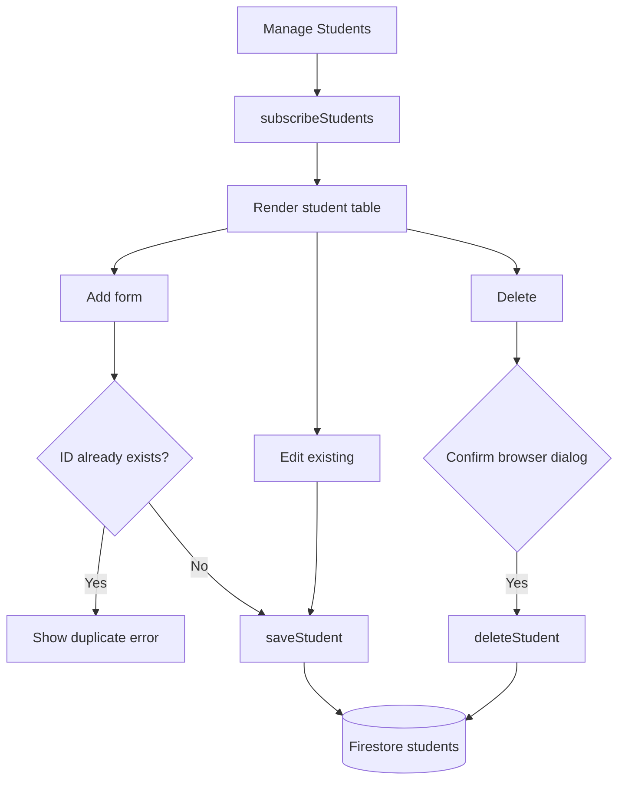
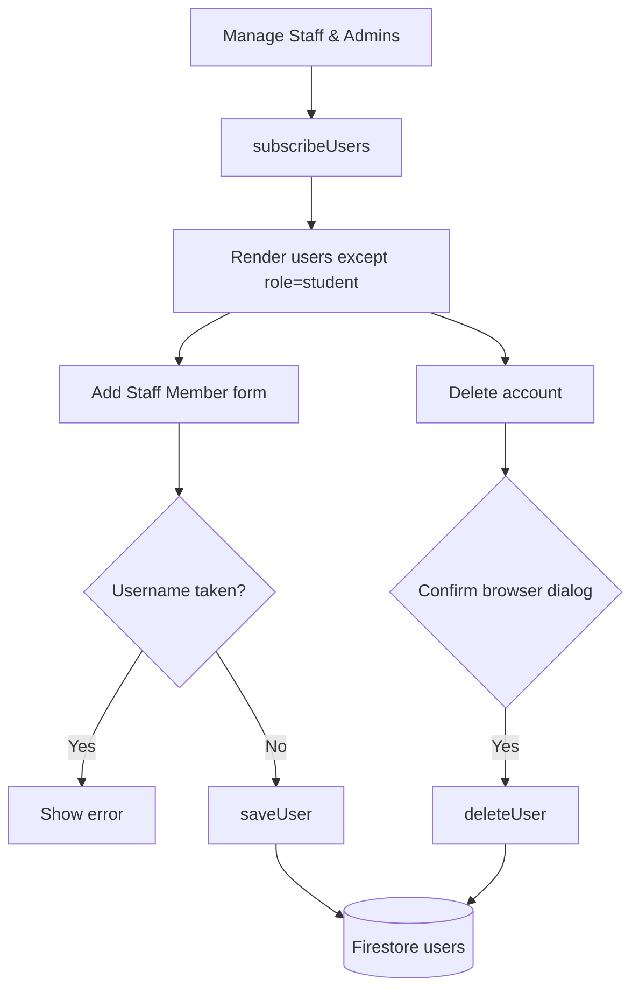

# User Flows

## Role-Based Navigation

## Student Self-Service Check-In

### Resulting Attendance Data

- `status`: `checked_in`
- `checkInMethod`: `student_self`
- `checkInTime`: current ISO time
- `checkOutTime`: `null`
- `smsNotificationSent`: `false`

## Student Self-Service Check-Out

### Resulting Attendance Data

- `status`: `checked_out`
- `checkOutTime`: current ISO time
- `pickupPerson` and `pickupPersonName`: selected pickup or fallback
- `smsNotificationSent`: `true`
- `smsSentAt`: current ISO time

## Staff-Assisted Check-In

### Staff Check-In Audit Fields

- `checkInStaffId`: logged-in staff/admin user ID.
- `checkInStaffName`: logged-in staff/admin name.
- `checkInMethod`: `staff_manual`.

## Staff-Assisted Check-Out

### Pickup Validation

The UI requires a pickup person string before completing staff-assisted check-out. The app does not validate custom pickup against a database-side policy.

## Admin Attendance Management

## Admin Student Management

## Admin Staff/Admin Management

## Checked-In Roster

The staff checked-in roster filters attendance records where:

- `date` equals today's `yyyy-MM-dd`.
- `checkInTime` is not null.
- `checkOutTime` is falsy/null.

It joins each record to a student profile by `studentId` for display.

