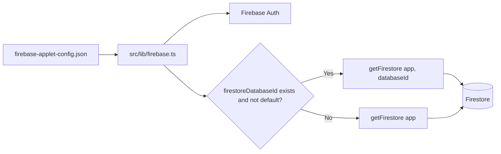
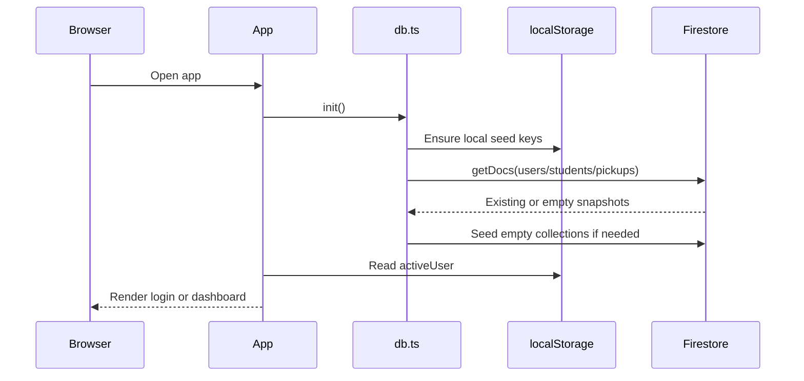

# Operations and Deployment

## Local Prerequisites

- Node.js installed.
- npm installed.
- Firebase project access if testing against the live configured project.
- Firebase Authentication enabled if testing staff/admin email/password sign-in.

The repository includes both `package-lock.json` and `bun.lock`. The current documented path uses npm because `package.json` scripts are standard npm scripts and `package-lock.json` is present.

## Local Setup

```bash
npm install
npm run dev
```

The dev script starts Vite on:

```text
http://localhost:3000
```

The script uses:

```json
"dev": "vite --port=3000 --host=0.0.0.0"
```

## Useful Commands

| Command | Purpose |
| --- | --- |
| `npm run dev` | Start local Vite dev server |
| `npm run build` | Build production assets into `dist/` |
| `npm run preview` | Preview the production build locally |
| `npm run lint` | Run TypeScript check with `tsc --noEmit` |
| `npm run clean` | Remove `dist` and `server.js` |

## Firebase Configuration

Firebase is initialized in `src/lib/firebase.ts` from:

```text
firebase-applet-config.json
```

The config includes:

- `projectId`
- `appId`
- `apiKey`
- `authDomain`
- `firestoreDatabaseId`
- `storageBucket`
- `messagingSenderId`
- optional `measurementId`

`src/lib/firebase.ts` initializes both Firebase Auth and Firestore. The current Firestore database ID is configured through `firestoreDatabaseId`. `src/lib/firebase.ts` chooses:

- `getFirestore(app, config.firestoreDatabaseId)` when the configured database is not `(default)`.
- `getFirestore(app)` otherwise.



## Firebase Authentication Setup

Staff/admin authentication is implemented in `src/lib/auth.ts` and used by `src/components/Login.tsx` and `src/App.tsx`.

Supported flows:

| Flow | Implementation |
| --- | --- |
| Email/password sign-in | `signInWithEmailAndPassword(auth, email, password)` |
| Google sign-in | Not completed for the delivered flow |
| Password reset | Not completed for the delivered flow |
| Auth state restore | `onAuthStateChanged(auth, callback)` |
| App user profile | Firestore `users/{uid}` document mapped to the app `User` shape |

Firebase Console checklist:

1. Open the configured Firebase project.
2. Go to **Authentication > Sign-in method**.
3. Enable **Email/Password** for staff/admin login.
4. Add the deployed domain and local development host to **Authentication > Settings > Authorized domains**.
5. Confirm Firestore has matching `users` documents for staff/admin profiles, or allow the app to create/sync profiles during sign-in.

Google sign-in and password reset are not completed in the delivered workflow. If they are required, enable/configure the Firebase providers, complete the UI flow, and test the end-to-end behavior before documenting them as supported.

MVP fallback behavior: if Firebase Auth is unavailable, disabled, or a user has not been created in Auth yet, `signInWithEmail()` attempts to match Firestore/local `users` credentials. This keeps demos working, but it means plaintext fallback passwords may still exist in Firestore and must be removed for production.

## Environment Variables

`.env.example` declares:

| Variable | Current app usage |
| --- | --- |
| `GEMINI_API_KEY` | Not used by current source files |
| `APP_URL` | Not used by current source files |

The app currently reads Firebase config from JSON, not environment variables.

## Data Seeding

Seed data is automatic on first load through `db.init()`.

### Default Seed Behavior

| Collection/key | Seed condition | Seed data |
| --- | --- | --- |
| `localStorage.checkin_users` | Missing key | 4 default users |
| `localStorage.checkin_students` | Missing key | 150 generated students |
| `localStorage.checkin_attendance` | Missing key | Empty array |
| Firestore `users` | Empty collection | 4 default users |
| Firestore `students` | Empty collection | 150 generated students |
| Firestore `authorized_pickups` | Empty collection | Pickup records generated from students |

### Manual Re-Seed

The data layer exposes `db.seed150Students()`, but no UI button currently calls it. A developer can add a temporary admin-only control or run equivalent code in a development harness if reseeding is required.

Important: reseeding through `saveStudents` will overwrite matching student documents by ID with generated data.

## Deployment Options

### Static Hosting

Because the app is a browser SPA, the production output from `npm run build` can be hosted on any static host that supports SPA fallback:

- Firebase Hosting
- Vercel
- Netlify
- Cloud Run static server
- S3/CloudFront

Build artifact:

```text
dist/
```

### Firebase Hosting Path

The repo has `firestore.rules`, but it does not currently include `firebase.json`. For Firebase Hosting handover, the receiving team should add Firebase CLI configuration similar to:

```json
{
  "hosting": {
    "public": "dist",
    "ignore": ["firebase.json", "**/.*", "**/node_modules/**"],
    "rewrites": [{ "source": "**", "destination": "/index.html" }]
  },
  "firestore": {
    "rules": "firestore.rules"
  }
}
```

Then the normal flow is:

```bash
npm run build
firebase deploy --only hosting
firebase deploy --only firestore:rules
```

Do not deploy the current open `firestore.rules` to production without replacing them.

## Runtime Data Flow



## Troubleshooting

| Symptom | Likely cause | What to check |
| --- | --- | --- |
| App shows local/demo data only | Firestore connection failed or rules/network issue | Browser console warnings from `db.ts`; Firebase project config |
| Login accepts stale users | `localStorage.checkin_users` still has old data | Clear site data or localStorage |
| Student list differs across devices | One device is using local fallback because Firestore failed | Console logs and Firestore rules |
| Duplicate attendance for same student/day | UI race or manual admin record | Search `attendance` by `studentId` and `date` |
| Staff/admin cannot login | Firebase Auth provider disabled, user missing from Firebase Auth/Firestore `users`, or password mismatch | Firebase Auth sign-in methods, authorized domains, Firestore `users` collection, and localStorage cache |
| Build fails on TypeScript | Type mismatch or dependency issue | Run `npm run lint` and inspect output |
| SMS was not actually sent | SMS is simulated in current MVP | Integrate real provider before production |
| Student direct check-out is blocked | Staff approval modal requires a valid staff/admin password or security PIN | Select an active staff/admin user and enter their stored password/PIN; check `users` data if validation fails |

## Browser Storage Reset

For local testing, clear these keys from browser localStorage:

```text
activeUser
checkin_users
checkin_students
checkin_attendance
```

Refreshing after clearing them will cause local seed data to be recreated.

## Operational Ownership

The receiving team should own:

- Firebase project access and billing.
- Firestore database backup/export policy.
- Firestore rules deployment.
- Hosting deployment.
- SMS provider integration.
- Firebase Auth provider configuration and production authentication policy.
- Monitoring and error reporting.

