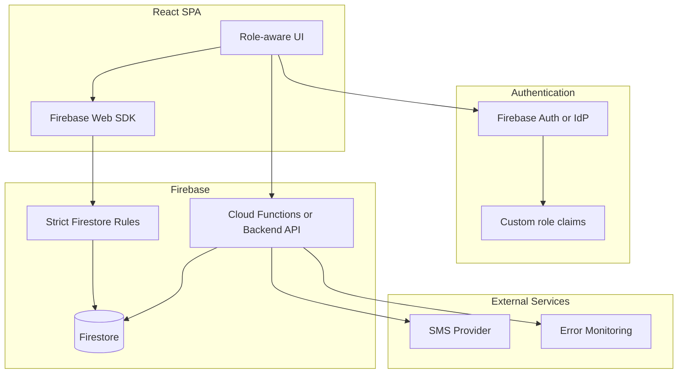
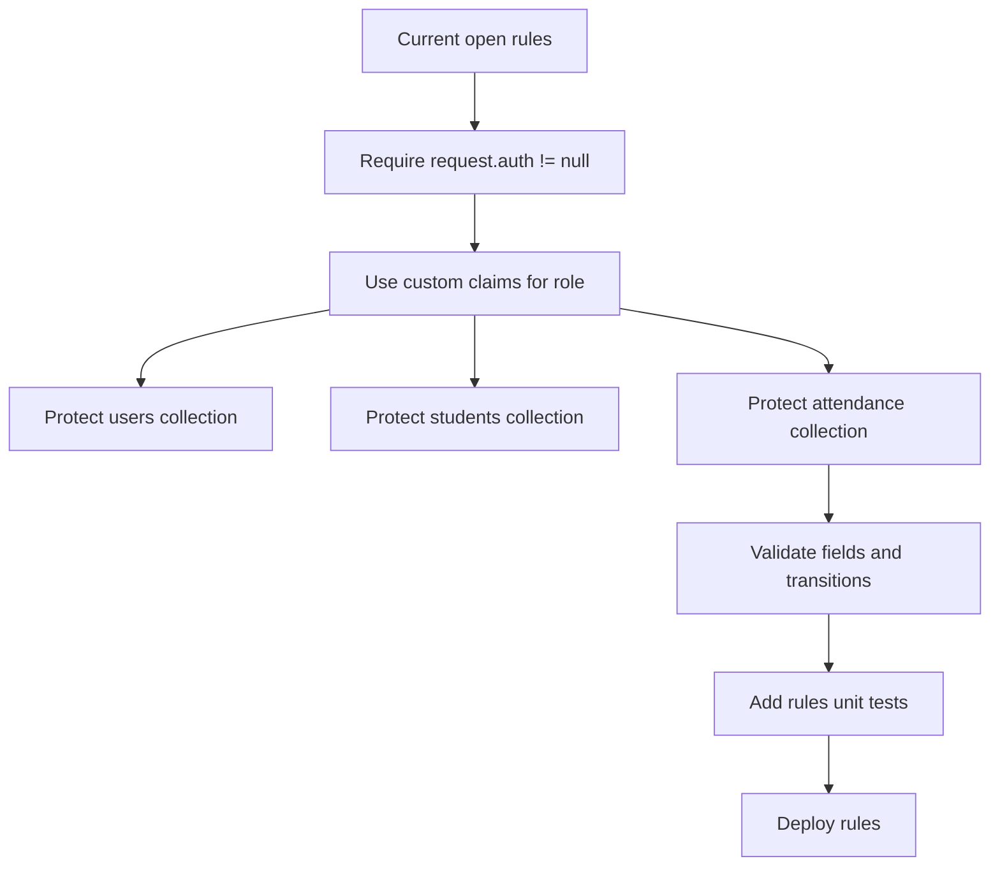

# Security and Production Readiness

## Current Security Posture

This MVP is suitable for prototype/demo use only. It should not be used with real student data until the items in this document are addressed.

## Critical Risks

| Risk | Current state | Impact | Required fix |
| --- | --- | --- | --- |
| Open Firestore rules | `allow read, write: if true` for all app collections | Anyone with app config can read/write all records | Replace with authenticated, least-privilege rules |
| Plaintext fallback passwords | Firebase Auth is integrated, but `users.password` can still be stored/read in browser for MVP fallback and staff approval | Account compromise and credential leakage | Remove plaintext fallback passwords; use Firebase Auth/custom claims or server-side staff approval |
| Client-side authorization | UI routes based on `user.role` from Firestore/localStorage/Firebase profile mapping | Users can tamper with role/session or fallback profile data in browser | Enforce roles in backend/rules/custom claims |
| Student PII in browser | Student/parent info syncs to any connected client allowed by current rules | Privacy exposure | Restrict reads by authenticated role and operational need |
| Simulated SMS | App marks SMS as sent without external delivery | False operational confidence | Add real SMS provider and delivery status |
| Editable/deletable audit records | Admin can mutate/delete attendance logs | Weak audit trail | Add append-only correction ledger or immutable audit events |
| No data validation in rules | Firestore accepts arbitrary document shapes | Corrupt/unsafe data | Add rule-level validation and server-side validation |
| Staff PIN approval is client-side | Student direct check-out requires `StaffApprovalModal`, but verification happens in the browser | A tampered client could bypass approval or forge `checkOutStaffId` | Enforce checkout approval with Firestore rules, custom claims, Cloud Functions, or a backend API |

## Current Firestore Rules

`firestore.rules` currently allows all reads and writes:

```text
match /users/{userId} {
  allow read, write: if true;
}
```

The same pattern is used for `students`, `authorized_pickups`, and `attendance`.

## Production Target Architecture



## Recommended Role Policy

| Action | Student | Staff | Admin |
| --- | --- | --- | --- |
| Read own student profile | Yes | Yes | Yes |
| Read all students | No | Yes, operational fields only | Yes |
| Create own check-in/out | Yes, own ID only | Yes | Yes |
| Correct attendance | No | No or limited | Yes |
| Delete attendance | No | No | Ideally no hard delete; use void/correction |
| Manage students | No | No | Yes |
| Manage staff/admins | No | No | Yes |
| Read users/passwords | No | No | No plaintext password reads ever |

## Authentication Migration Plan

Firebase Auth has been integrated for staff/admin email/password sign-in and auth-state restore. Google sign-in and password reset are not completed in the delivered workflow. Remaining production migration work:

1. Ensure all real staff/admin users are created in Firebase Auth.
2. Complete and test Google sign-in and password reset only if those flows are required.
3. Remove `password` from Firestore `users` and eliminate Firestore/local credential fallback in `src/lib/auth.ts`.
4. Assign role claims (`admin`, `staff`, optionally `student`) through a trusted server process.
5. Treat Firestore `users.role` as display/profile data only, not as the source of authorization.
6. Stop storing the full active user object as authority in `localStorage`.
7. Use ID token claims and Firestore rules for enforcement.
8. Move staff approval for student direct check-out to server-enforced logic or strict Firestore rules.

## Firestore Rules Hardening Plan



Minimum rule requirements:

- Require authenticated requests.
- Deny all unknown collections.
- Prevent clients from writing `role` fields unless admin.
- Prevent direct password reads/writes.
- Validate required attendance fields.
- Restrict student self-service writes to that student's own records.
- Require staff/admin authorization fields for checkout transitions, especially student direct check-out.
- Prevent non-admin deletes.
- Prefer soft-delete or correction records over hard deletes.

## SMS Integration Requirements

Current behavior only sets:

- `smsNotificationSent: true`
- `smsSentAt: now`
- A UI preview message

For production:

1. Add a server-side function for check-out notification.
2. Store SMS provider message ID and delivery state.
3. Retry transient failures.
4. Log failed deliveries clearly for staff/admin follow-up.
5. Do not call SMS provider directly from the browser.

Suggested fields:

| Field | Type | Purpose |
| --- | --- | --- |
| `smsProvider` | string | Provider name |
| `smsMessageId` | string | Provider message ID |
| `smsStatus` | `queued`, `sent`, `delivered`, `failed` | Delivery lifecycle |
| `smsError` | string | Failure reason |

## Audit Trail Recommendations

The current `attendance` record is mutable. For production, use one of these patterns:

- Append-only `attendance_events` collection with events like `CHECKED_IN`, `CHECKED_OUT`, `CORRECTED`, `VOIDED`.
- Immutable attendance records plus separate `attendance_corrections`.
- Soft delete with `deletedAt`, `deletedBy`, and `deleteReason` instead of hard delete.

Recommended correction shape:

```json
{
  "id": "uuid",
  "attendanceRecordId": "uuid",
  "changedByUserId": "u1",
  "changedAt": "2026-08-21T10:30:00.000Z",
  "reason": "Corrected checkout time",
  "before": { "checkOutTime": "2026-08-21T10:15:00.000Z" },
  "after": { "checkOutTime": "2026-08-21T10:25:00.000Z" }
}
```

## Privacy Checklist

- Confirm whether parent phone/email is legally allowed to be stored in Firestore for this use case.
- Add data retention policy for attendance records.
- Restrict exports and backups.
- Add production logging without exposing student PII in logs.
- Document who can access Firebase Console.
- Clear demo seed data before importing real data.

## Production Go/No-Go

Do not go live with real student data until:

- Firestore rules are locked down.
- Plaintext fallback password login is removed and Firebase Auth/role claims are enforced.
- SMS is real or clearly disabled in product copy.
- Admin destructive actions are audited.
- Firestore backups/exports are configured.
- Hosting environment is controlled by the receiving team.
- Acceptance testing covers all role workflows, including student direct check-out requiring staff/admin PIN approval.

