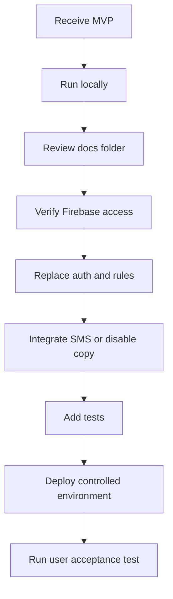

# Handover Checklist

Use this checklist before transferring ownership to another team/person.

## Code and Repository

- [ ] Confirm repository access is transferred.
- [ ] Confirm the receiving team can run `npm install`.
- [ ] Confirm the receiving team can run `npm run dev`.
- [ ] Confirm the receiving team can run `npm run build`.
- [ ] Confirm the receiving team understands the app has no backend API in the current implementation.
- [ ] Confirm the receiving team reviewed `src/lib/db.ts`.
- [ ] Confirm the receiving team reviewed `firestore.rules`.

## Firebase

- [ ] Transfer Firebase project access.
- [ ] Confirm the Firestore database ID in `firebase-applet-config.json`.
- [ ] Confirm the receiving team can view these collections: `users`, `students`, `attendance`, `authorized_pickups`.
- [ ] Confirm whether demo seed data should remain or be deleted.
- [ ] Decide who owns Firestore rules.
- [ ] Decide who owns Firestore backups/exports.
- [ ] Decide whether the app will stay on the current Firebase project or move to a new one.

## Credentials and Test Accounts

- [ ] Share MVP demo accounts through a secure channel, not in a public document.
- [ ] Confirm default MVP accounts are changed or removed before production.
- [ ] Confirm plaintext password storage is understood as an MVP-only limitation.
- [ ] Confirm localStorage session behavior is understood.

## Product Workflows

- [ ] Student self-service check-in tested.
- [ ] Student self-service check-out tested.
- [ ] Staff-assisted check-in tested.
- [ ] Staff-assisted check-out tested.
- [ ] Staff checked-in roster tested.
- [ ] Admin attendance search/filter tested.
- [ ] Admin manual attendance creation tested.
- [ ] Admin attendance correction tested.
- [ ] Admin attendance deletion tested.
- [ ] Admin student add/edit/delete tested.
- [ ] Admin staff/admin add/delete tested.

## Production Readiness Decisions

- [ ] Decide production authentication approach.
- [ ] Decide production role/permission model.
- [ ] Decide real SMS provider and integration owner.
- [ ] Decide audit-trail requirements.
- [ ] Decide data retention period.
- [ ] Decide PII access policy.
- [ ] Decide deployment target.
- [ ] Decide monitoring/error reporting tool.

## Suggested Acceptance Questions

The receiving team should be able to answer these after handover:

1. Where is Firebase initialized?
2. Which Firestore collections does the app use?
3. How does the app seed demo data?
4. What happens if Firestore is unavailable?
5. How does a student check in?
6. How does staff-assisted check-out capture pickup information?
7. How does an admin correct attendance?
8. Which parts are MVP-only and unsafe for production?
9. What must change before real student data is entered?
10. How is SMS currently represented, and why is it not real delivery?

## Recommended First Tasks for Receiving Team

## Final Handover Notes

- The MVP prioritizes functional demonstration over production controls.
- The most important technical debt is security, not UI behavior.
- Firestore rules and plaintext password handling must be fixed before production.
- Current SMS is a UI/data flag simulation.
- Realtime behavior depends on Firestore listener access from the browser.

