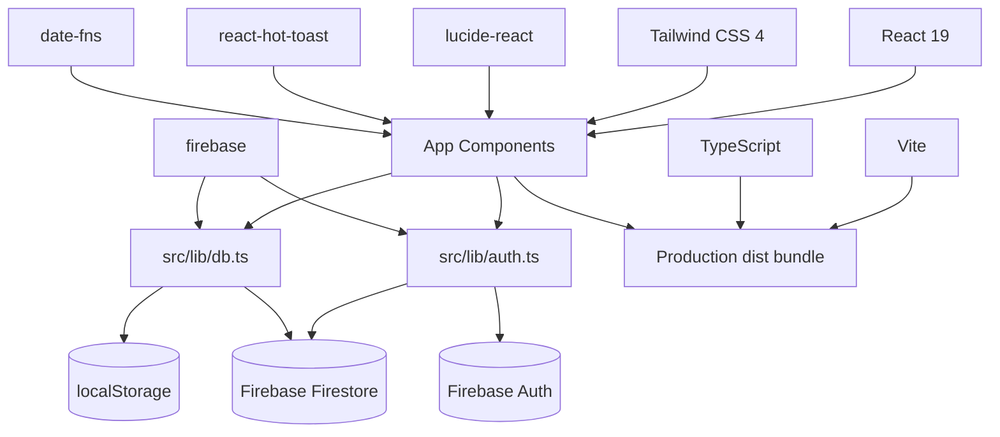

# Tech Stack and Dependencies

## Stack Summary

| Layer | Technology | Current usage |
| --- | --- | --- |
| Language | TypeScript | App source and shared interfaces |
| UI | React 19 | Components, state, rendering |
| Build | Vite 6 | Dev server and production bundle |
| Styling | Tailwind CSS 4 | Utility styling through `src/index.css` and Vite plugin |
| Authentication | Firebase Auth | Staff/admin email/password sign-in and auth-state restore; Google sign-in and password reset are not completed |
| Database | Firebase Firestore | Realtime document storage |
| Data access | Firebase Web SDK | Browser-side auth, reads/writes/subscriptions |
| Notifications | `react-hot-toast` | Toast success/error messages |
| Icons | `lucide-react` | UI iconography |
| Dates | `date-fns` | Date keys and display formatting |
| Local cache | Browser `localStorage` | Session and fallback data cache |

## Runtime Dependency Diagram



## Package Scripts

| Script | Command | Notes |
| --- | --- | --- |
| `dev` | `vite --port=3000 --host=0.0.0.0` | Local dev server |
| `build` | `vite build` | Production build |
| `preview` | `vite preview` | Preview built assets |
| `clean` | `rm -rf dist server.js` | Removes build/server artifacts |
| `lint` | `tsc --noEmit` | TypeScript validation; no ESLint configured |

## Key Runtime Dependencies

| Dependency | Why it exists |
| --- | --- |
| `firebase` | Firebase app initialization, Auth email/password sign-in/sign-out/auth-state APIs, Firestore document writes, batch writes, collection reads, realtime listeners |
| `react` / `react-dom` | Browser UI |
| `date-fns` | `format(new Date(), 'yyyy-MM-dd')` day keys and display formatting |
| `lucide-react` | Icons in login, dashboards, tables, and actions |
| `react-hot-toast` | User feedback after login, CRUD, and attendance actions |
| `tailwindcss` / `@tailwindcss/vite` | CSS utility pipeline |
| `clsx` / `tailwind-merge` | Utility class merging in `src/lib/utils.ts` |

## Dependencies Present but Not Materially Used

These packages are installed but not used by the current app source in a meaningful way:

| Dependency | Notes |
| --- | --- |
| `@google/genai` | Present from AI Studio scaffold; no current source calls Gemini APIs |
| `dotenv` | Present, but current browser app reads Firebase config from JSON |
| `express` and `@types/express` | Present, but there is no active backend server source |
| `motion` | Present, but current UI uses CSS classes rather than this library |
| `react-router-dom` | Present, but navigation is state-based in `App.tsx` |

Receiving team can remove unused dependencies after confirming there are no planned near-term features relying on them.

## Build Output

`npm run build` writes static assets to:

```text
dist/
```

Typical output files:

```text
dist/index.html
dist/assets/*.css
dist/assets/*.js
```

## TypeScript Configuration

The app uses `tsconfig.json` and validates with:

```bash
npm run lint
```

Despite the script name, this is TypeScript type checking only:

```json
"lint": "tsc --noEmit"
```

## Styling Notes

`src/index.css` imports Tailwind:

```css
@import "tailwindcss";
```

Most visual styling is inline through Tailwind utility class strings in component files. There is no separate component library or design token file.

## Firebase SDK Usage

Auth operations used in `src/lib/auth.ts`:

| Function | Purpose |
| --- | --- |
| `signInWithEmailAndPassword` | Staff/admin email/password sign-in |
| `createUserWithEmailAndPassword` | Staff/admin account creation/sync from admin UI or fallback flow |
| `signInWithPopup` and `GoogleAuthProvider` | Present in helper code, but Google sign-in is not completed in the delivered flow |
| `sendPasswordResetEmail` | Present in helper code, but password reset is not completed in the delivered flow |
| `onAuthStateChanged` | Restore Firebase Auth sessions into app user state |
| `signOut` | Firebase sign-out on app logout |
| `updateProfile` | Store display name on Firebase Auth user |

Firestore operations used in `src/lib/db.ts` and `src/lib/auth.ts`:

| Function | Purpose |
| --- | --- |
| `collection` | Collection references |
| `doc` | Document references |
| `getDocs` | Initial empty-collection checks during seed |
| `setDoc` | Create/update documents |
| `deleteDoc` | Delete documents |
| `onSnapshot` | Realtime subscriptions |
| `writeBatch` | Batch seed/save operations |

## Version Management Notes

- `package-lock.json` exists and should be treated as the npm lockfile.
- `bun.lock` also exists, likely from prior tooling. Pick one package manager for ongoing ownership to avoid lockfile drift.
- Current verification was performed with npm scripts.

